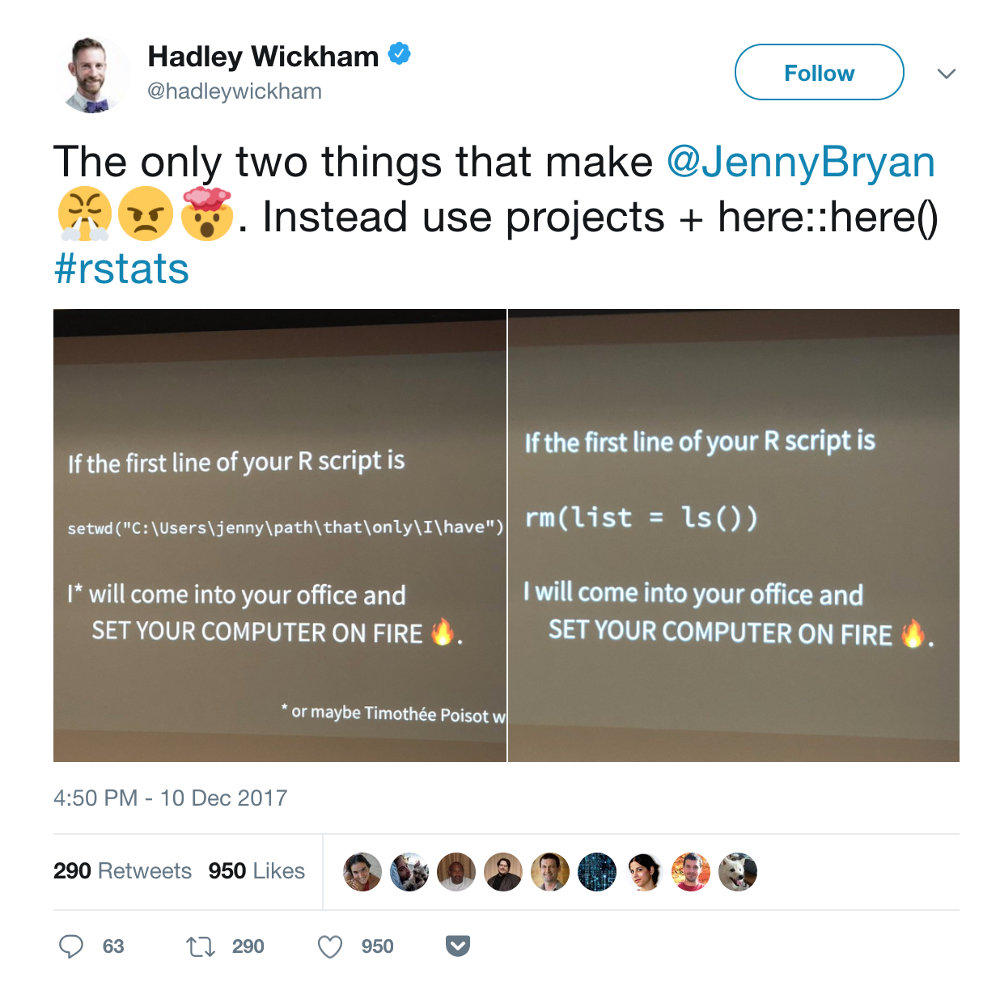

:::::::::::::::::::::::::::::::::::::: questions 

- What are some things we typically do not mention?

::::::::::::::::::::::::::::::::::::::::::::::::

::::::::::::::::::::::::::::::::::::: objectives

- Get an overview of some of the rabbit holes.

::::::::::::::::::::::::::::::::::::::::::::::::

## Introduction

What we forgot to tell you about R. A collection of details, tips, tricks etc in and with R

## Math in R is imprecise!

It might appear that we get a correct result when we ask R to do math.

But we do not. Every time we do math on numbers with decimals, we can expect 
numerical errors. 

This:

```{r num-impres-1}
7/13 - 3/31
```

is different from: 
```{r num-impres-2}
print(7/13 - 3/31, digits = 16)
```
Actually $\frac{7}{13} - \frac{3}{31}$ is equal to $\frac{178}{403}$. If we subtract
one from the other, we should get 0. We do not...

```{r num-impres-3}
(7/13 - 3/31) - (178/403) 
```

Pretty close but not 0.

R, in the best case, uses 64 bits for storing numerics, and that means the best
we can expect to be correct is 15-16 significant digits after the decimal separator.

Because of this, we have to expect errors, and that they might accumulate.


## When should the warning be ignored?

Never. In introductory courses we tend to tell learners that they should not
worry too much about warnings. 

That is because they generally _can_ be ignored, and they tend to get in the
way of learning the ropes.

However. The moment you have learned (a bit of) R, you should stop ignoring 
errors. What you should do is:

1. Figure out what the warning is saying
2. Figure out why the warning is triggered
3. Figure out the effect on the results of the computation
4. Determine based on step 3, if your results will be erronious

After that, you might decide that the warning can be safely ignored.


## Do not spend too much time optimizing

Uwes maxim:

Computers are cheap and thinking hurts

Uwe Ligges, member of R Core Team

Your first task is to write clear, understandable and correct code.

When you have debugged your code, when it is stable and correct, and easy for
other people to understand, you might consider optimizing it.

But only if that optimization is likely to make a significant difference. 
Spending an hour to save a millisecond is not useful. Unless that function runs
at least 4 million times, in which case you might actually save time.

## Naming stuff is difficult

how to name stuff af jenny bc

## Think global, act local

We do not usually talk about the scope of object/variables/data in R.

Scoping determines where an object is available. 

Or something like that. The scope you are working in matters.


## Write functions

R is a good thing because it is a language.
The power of language is abstraction.
The way to make abstractions in R is to write functions.

og det er når vi begynder at skrive funktoner, at vi bevæger os fra
at bruge R, til at programmere i R.

When you write functions - write small functions. Functions that do one, and only one thing.
It make it much easier to locate the error when, not if, that happens. 
Small functions also have a higher probability of being useful in other contexts.

## Functions that produce functions

Funktioner hvis output er en funktion.

```{r func-making-func}
mycumfun <- ecdf(rnorm(10))
mycumfun(0)
```


https://rstudio.github.io/renv/

## Writing dates

There are many ways of writing dates. And all but one is wrong. 

These problems have bothered people working with data for many years. The problem was solved with a standard, ISO-8601,
creating the new problem of getting people to follow the standard.


## Shortcuts

Tools → Keyboard Shortcuts Help. alt-shift-k (Option+Shift+K på mac)


 environments.

## Factor variable trap

Når du konverterer faktorer/kategoriske variable - til numeric, så konverter
faktoren til character først:

fin$profit <- as.numeric(as.character(x))
hvor x er en faktor.

Konverterer du en faktor direkte til en numeric, får du faktor levels (1,2,3 etc)
i stedet for de numeriske værdier der egenligt ligger i faktoren.

## Prevent fires



What's wrong with rm(list=ls())?

This indicates that whatever you do is not actually reproducible.

What the line _attempts_ to do, is to reset things. To make sure that whatever you have
in the memory of R, is gone, and that you begin in a fresh environment. The idea is to
make sure that you begin from scratch and nothing is in the memory of the computer that could affect
your code.

Given that intention, it does not do enough. 

It will delete objects in memory that you as a user, have created. However, lots of
other stuff can change the behaviour of R. Any options you may have set to something
different than default are still set. If you have loaded a library, it is still attached.

Instead - write every script assuming it will be run in a fresh R process. And the best way
to do that, is to write your scripts in a fresh R process. 

There is not anything bad with `rm(list=ls())`. But it is a warning that your workflow might
not be reproducible. It works ~95% of the time. And makes it very difficult to fix problems in
the remaining 5%.


## Lazy evaluation

R does what is called lazy evaluation. But what does that mean?

When we write an expression that expression is only evaluated when the result is needed. 

An example:

This is an expression

```{r eval = FALSE}
stop("error")
```

`stop` is used to stop a function and return an error message. If we evaluate it, we will get 
scary red text on the console, an indication of an error, and the messange "error". We get that, because
the expression is evaluated.

If we write a function that takes two arguments, but only works on one:

```{r}
lazy_test <- function(x, y){
    message("only working on x")
    x^2
}


```

And then pass our stop-expression to that function:
```{r}
lazy_test(x = 5, y = stop("error"))
```

We do not get an error. Because y is not used in the function, the value of y is never 
calculated, and the `stop("error")` expression is not calculated either.

The opposite of lazy evaluation is eager evaluation. Under eager evaluation, all expressions are
evaluated whenever they are expressed. As R uses lazy evaluation by default, it is not easy to illustrate.
Here is an attempt:

```{r}
f_eager <- function(x, y) {
  force(y)            # tvinger evaluering af y med det samme
  message("Beregner x og y")
  x^2
}

f_eager(3, stop("fejl")) 
```

In short, lazy evaluation delays the calculation until a result is actually needed. This will, as a 
general rule of thumb save ressources. We may not need to evaluate a complex expression, so there is 
no reason to actually do it. On the other hand, this can make it more difficult to debug code, as the 
reason for an error might hide many lines earlier than it actually occurs.


```{r integrate}
integrand <- function(x) {1/((x+1)*sqrt(x))}
integrate(integrand, lower = 0, upper = Inf)

```

# Nifty tricks

Which might belong on another page, but now they are here

## Copy-paste from excel

If you are working on a windows computer, and you need to get data from Excel to R, you can select the data in Excel, copy it, and run this code:

```{r clipboard-1, eval = FALSE}
data <- read.delim(
"clipboard",
header = TRUE,
check.names = FALSE
)
```

If you are working with a danish version of Excel, you might have to do this instead, if the data is semicolon, rather than comma separated:

```{r clipboard-2, eval = FALSE}
data <- read.delim2(
"clipboard",
header = TRUE,
check.names = FALSE
)
```

If the selection from Excel does not include column names:

```{r clipboard-3, eval = FALSE}
data <- read.delim(
"clipboard",
header = FALSE
)
```

But beware! This almost quarantee that your script will not be reproducible!

::::::::::::::::::::::::::::::::::::: keypoints 

- You will continue to learn new stuff
- Do not despair when you discover things that would have saved a lot of time if only you've known about it earlier. It will happen again!


::::::::::::::::::::::::::::::::::::::::::::::::

