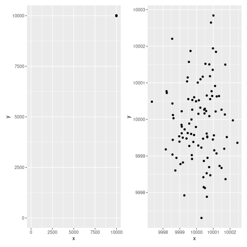

:::::::::::::::::::::::::::::::::::::: questions 

- ggplot

::::::::::::::::::::::::::::::::::::::::::::::::

::::::::::::::::::::::::::::::::::::: objectives

- ggplot


::::::::::::::::::::::::::::::::::::::::::::::::

## Introduction


## Axes

By default ggplot zooms in on the data. This break one of the most popular rules 
when visualizing data - always include zero on the axes. 

This rule is not always helpful - as illustrated below


``` output
── Attaching core tidyverse packages ──────────────────────── tidyverse 2.0.0 ──
✔ dplyr     1.2.1     ✔ readr     2.2.0
✔ forcats   1.0.1     ✔ stringr   1.6.0
✔ ggplot2   4.0.3     ✔ tibble    3.3.1
✔ lubridate 1.9.5     ✔ tidyr     1.3.2
✔ purrr     1.2.2     
── Conflicts ────────────────────────────────────────── tidyverse_conflicts() ──
✖ dplyr::filter() masks stats::filter()
✖ dplyr::lag()    masks stats::lag()
ℹ Use the conflicted package (<http://conflicted.r-lib.org/>) to force all conflicts to become errors
```



::::spoiler
## Show the code


``` r
library(tidyverse)
library(patchwork)
data <- tibble(x = rnorm(100, mean = 10000), y = rnorm(100, mean = 10000))
p_2 <- data |> 
    ggplot(aes(x, y)) +
    geom_point()

p_1 <- p_2 + expand_limits(x = c(0,10010), y = c(0,10010))


p_1 + p_2
```

::::

These two scatterplots show the exact same data, the first have an origin of the coordinate system in (0,0). The other zoom in on the data.

Controlling the scales - to make sure that certain values are included, can be done in several ways.

In this specific example data was constructed to be normally distribued around (10000, 10000), and 
the plot on the left was constructed by adding:


``` r
+ expand_limits(x = c(0,10010), y = c(0,10010))
```

to the original plot.

But a more robust way 


``` r
p_2 + 
    scale_x_continuous(limits = ~range(.x, 0)) +
    scale_y_continuous(limits = ~range(.x, 0)) 
```

the `.x` refers to the range for the scale (x and y respectively), that is calculated automatically by ggplot. In this case that returns 9997.3032357, 1.0002841\times 10^{4}, we add 0 to that, and calculate the limits usin the range function.


::::::::::::::::::::::::::::::::::::: keypoints 

- ggplot


::::::::::::::::::::::::::::::::::::::::::::::::

