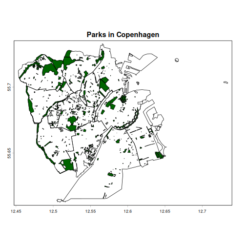
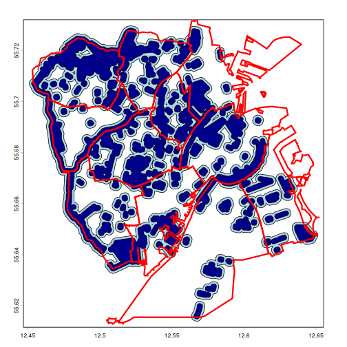
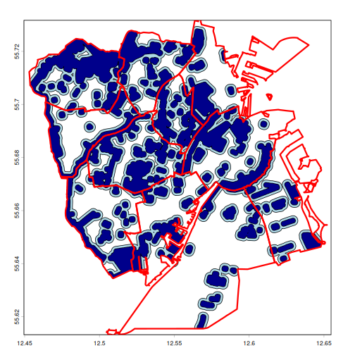
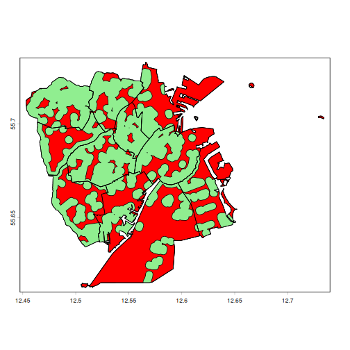
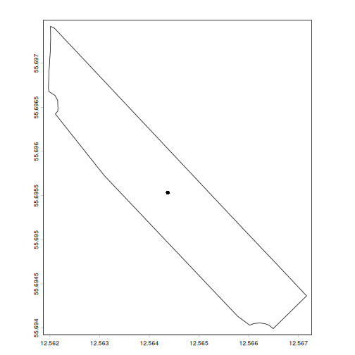

::: questions
-   FIXME
:::

::: objectives
-   FIXME

:::


## Introduction

Let's start by getting our hands on some spatial vector data. 

From the website we can download two vector files with the `.gpkg` extension (signifying it is in the format geopackage). The first represent the neighbourhoods of Copenhagen and the municipality of Frederiksberg, the second parks in these two municipalities:

* [Neighborhoods](data/cph_neighborhoods_and_frederiksberg.gpkg)
* [Parks](data/parks_cph_frederiksberg.gpkg)

The first is extracted from the databank of Copenhagen, augmented with the borders of Frederiksberg extracted from OpenStreetMaps using the `osmdata` package.

The second is also extracted from OpenStreetMaps.

Rather than downloading them manually, we can run the following script to download them directly to our `data` folder:


``` r
urls <- c("https://raw.githubusercontent.com/KUBDatalab/R-toolbox/main/episodes/data/cph_neighborhoods_and_frederiksberg.gpkg",
"https://raw.githubusercontent.com/KUBDatalab/R-toolbox/main/episodes/data/parks_cph_frederiksberg.gpkg"

download.file(
  urls,
  destfile = file.path("data", basename(urls)),
  mode = "wb"
)
```

We are going to learn manipulating spatial vector data by analysing the accessibility of parks in the urban environment.

## Read and inspect data

Working with raster data, we used the `raster` function from the `terra` package. Now we are working with vector data, and use the `vec` function:


``` r
library(terra)

neighborhoods <- vect("data/cph_neighborhoods_and_frederiksberg.gpkg")
parks <- vect("data/parks_cph_frederiksberg.gpkg")
```

If we are not 100% sure of the quality of the data we have downloaded, it is best practice to check that the
geometries are valid. The function `is.valid` checks this, and will return TRUE or FALSE for each object within the data. As the `parks` dataset contains 1014 parks, it will be difficult to identify if one of them is invalid. The `all` function returns TRUE if all values are TRUE:


``` r
all(is.valid(parks))
[1] TRUE
all(is.valid(neighborhoods))
[1] TRUE
```

We can inspect the data by simply calling the name:


``` r
neighborhoods
```

``` output
class       : SpatVector
geometry    : polygons
dimensions  : 11, 2  (geometries, attributes)
extent      : 12.45305, 12.73425, 55.61284, 55.73271  (xmin, xmax, ymin, ymax)
source      : cph_neighborhoods_and_frederiksberg.gpkg (områder)
coord. ref. : lon/lat WGS 84 (EPSG:4326)
names       :      name population
type        :     <chr>      <num>
values      :  Indre By      58224
              Nørrebro      79779
               Vanløse      40847
              ...
```

And we can get a closer look at the `name` attribute using the `$` notation, which returns a character vector with the names of the polygons:


``` r
neighborhoods$name
```

``` output
 [1] "Indre By"                  "Nørrebro"                 
 [3] "Vanløse"                   "Brønshøj-Husum"           
 [5] "Bispebjerg"                "Amager Øst"               
 [7] "Amager Vest"               "Vesterbro-Kongens Enghave"
 [9] "Valby"                     "Østerbro"                 
[11] "Frederiksberg"            
```

:::: challenge
## What about the names of the parks?

Use the same technique to extract the names of the parks.

:::: solution
## Solution

To save space this code only return the first 10 names:

``` r
parks$name |> head(n = 10)
```

``` output
 [1] "Ørstedsparken"       "Botanisk Have"       "Hørsholmparken"     
 [4] "Nørrebroparken"      "Filipsparken"        "Fredens Park"       
 [7] "Amorparken"          NA                    "Mindelunden"        
[10] "Jensen Klints Plads"
```

From this we learn that a lot of what OpenStreetMaps considers parks, do not have a name. For serious work we would probably have to apply some sort of selection to this dataset.

::::
::::

Not all parks have names. We can check for missing values using the `is.na()` function on the `name` attribute. Nesting that into the `table()` function, we can see how many parks are nameless:


``` r
# Missing park name?
table(is.na(parks$name))
```

``` output

FALSE  TRUE 
  143   871 
```

Most of what OSM considers parks in this area have no names.

## Simple Plots

For simple visualizations, we use the `plot()` function. We would like to have parks overlaid on the neighborhoods, and must use the `add = TRUE` argument to do that. The first plot is displayed as a base layer, and subsequent plots are added on top of that:


``` r
plot(neighborhoods, main = "Parks in Copenhagen")
plot(parks, add = TRUE, col = "darkgreen")
```



## Polygon Statistics

Both neighborhoods and parks are polygons with an area and a perimeter. 

The information is not stored directly in the data, but can be calculated from the data using the `expance()` and `perim()` functions from the `terra` package:


``` r
neighborhoods$area_m2 <- expanse(neighborhoods, unit = "m")
neighborhoods$perimeter_m <- perim(neighborhoods)
neighborhoods
```

``` output
class       : SpatVector
geometry    : polygons
dimensions  : 11, 4  (geometries, attributes)
extent      : 12.45305, 12.73425, 55.61284, 55.73271  (xmin, xmax, ymin, ymax)
source      : cph_neighborhoods_and_frederiksberg.gpkg (områder)
coord. ref. : lon/lat WGS 84 (EPSG:4326)
names       :      name population     area_m2 perimeter_m
type        :     <chr>      <num>       <num>       <num>
values      :  Indre By      58224 1.04671e+07     20448.2
              Nørrebro      79779 4.10605e+06     9707.62
               Vanløse      40847 6.69647e+06     13894.2
              ...
```

Note that we do not have to provide a unit for the calculation of the perimeter; the only possible output is in meters.


:::: challenge
## Which neighborhood is the smallest?

Try to figure out which of the neighborhoods (and/or Frederiksberg) is the smallest.


:::: hint
## Hint
We can extract values from the neighborhood object using the `values()` function (just like we did with raster data). After that, we can sort using the tidyverse functions. Remember to run `library(tidyverse)`

An easier solution is to convert the spatial object to a data frame, using either `as.data.frame()` or `as_tibble()`´. The last option give a nicer looking output.

::::


:::: solution
## Solution


``` r
library(tidyverse)
neighborhoods |> 
    as_tibble() |> 
    arrange(area_m2) |> 
    slice(1)
```

``` output
# A tibble: 1 × 4
  name     population  area_m2 perimeter_m
  <chr>         <dbl>    <dbl>       <dbl>
1 Nørrebro      79779 4106045.       9708.
```


::::
::::


:::: challenge
## Add a calculated area and perimeter to the parks

Repeat the calculations we did on the neighborhoods to add areas and perimeters to the parks.

:::: solution
## Solution


``` r
parks$area_m2 <- expanse(parks, unit = "m")
parks$perimeter_m <- perim(parks)
```


::::
::::


``` r
parks
```

``` output
class       : SpatVector
geometry    : polygons
dimensions  : 1014, 5  (geometries, attributes)
extent      : 12.45406, 12.64811, 55.61572, 55.72894  (xmin, xmax, ymin, ymax)
source      : parks_cph_frederiksberg.gpkg (parks)
coord. ref. : lon/lat WGS 84 (EPSG:4326)
names       :  osm_id            name   dog area_m2 perimeter_m
type        :   <chr>           <chr> <chr>   <num>       <num>
values      : 3098756  Ørstedsparken    NA 64378.8     1090.32
              3098803   Botanisk Have    NA  120140     1447.47
              3099108 Hørsholmparken    NA 15398.7     844.803
              ...
```

To make further analysis easier, we exclude parks smaller than 2000 $m^2$. We can treat the `park` data as a data frame, and select rows based on a logical comparison of `parks$area_m2` with 2000:


``` r
parks_clean <- parks[parks$area_m2 > 2000, ] 
```


## Spatial Relationships

Which neighborhoods have the most parks? 

The function `relate()` take two spatVector objects, and return a logical matrix indicating if there is a relation between the objects in the two spatial vectors. It can handle different relations (see the list in the documentation running `?relate`). Here we ask if there is an intersection between the objects - more intuitively: "is there an overlap". That also means that some parks might be located in more than one neighborhood


``` r
intersect_matrix <- relate(neighborhoods, parks_clean, relation = "intersects") 
```

The result is a logical matrix. We can easily figure out how many parks are in each neighbourhood. Each row is one neighbourhood, each column is a park. And the cell that intersects a row and a column, is TRUE if the park is located (partially) in the neighbourhood. Adding the values in each row, tells us how many parks are in each neighbourhood: 


``` r
rowSums(intersect_matrix)
```

``` output
 [1] 44 38 24 44 34 27 24 56 31 18 78
```

We do not get the names, but the order of neighbourhoods in the matrix is the same as the order of the names of the neighbourhoods in our `neighbourhoods` data. That means we can augment the result and get a nice table:


``` r
neighbourhood_stat <- data.frame(name = neighborhoods$name, count = rowSums(intersect_matrix))
neighbourhood_stat
```

``` output
                        name count
1                   Indre By    44
2                   Nørrebro    38
3                    Vanløse    24
4             Brønshøj-Husum    44
5                 Bispebjerg    34
6                 Amager Øst    27
7                Amager Vest    24
8  Vesterbro-Kongens Enghave    56
9                      Valby    31
10                  Østerbro    18
11             Frederiksberg    78
```

:::: callout
But what are the names? 

One problem with this approach is that some of the parks, even those larger than 2,000 square meters, do not have a name.

We can instead rely on the osm_id which uniquely identify the parks.

Adding those to the `intersect_matrix` allow us to know which parks are in which neighbourhoods, and do further analysis on e.g. total park area in different neighbourhoods. We can do that using `colnames()` and `rownames()` as showwn below. After that we can convert the matrix to a data frame. We recommend using `as_tibble()` with the additional argument `rownames = "name`:


``` r
colnames(intersect_matrix) <- parks_clean$osm_id
rownames(intersect_matrix) <- neighborhoods$name

intersect_matrix |> as_tibble(rownames = "name")
```
::::


## Availability Analysis

What is the availability of parks in Copenhagen? Or, which parts of the city lies within 300 meters of a park? And which lies within 1000 meters?

:::: challenge
How would we do that? Not - how should the code look like, but what would be the conceptual steps in doing that be? Discuss!

:::: solution
There are probably many ways of doing this. One suggestion would be:

* "Expand", or add 300 (or 1000) meters to each polygon describing a park
* Merge any of these new polygons if they overlap
* Plot and colour the new polygons - overlaid on the map of the neighbourhoods

::::

::::

The new polygons we want to look at are the existing polygons - with an added "buffer" of 300 (and 1000) meters.

We create those new polygons using the `buffer()` function:


``` r
buffer_100 <- buffer(parks_clean, width = 100)
buffer_200 <- buffer(parks_clean, width = 200)
```

Some parks and their buffers, overlap. We can "aggregate" them into single polygons using the `aggregate()` function:


``` r
buffer_100 <- aggregate(buffer_100)
buffer_200 <- aggregate(buffer_200)
```

And now we can plot them:


``` r
plot(buffer_200, col = "lightblue")
plot(buffer_100, col = "darkblue", add = TRUE)
plot(neighborhoods, add = TRUE, lwd = 3, border = "red")
```



Plotting in this way places each new plot on top of the others, so the order is important!

Some of the buffered parks extends outside the city. We can cut the off using the `crop()` function, specifying the borders of the city. We begin by aggregating the neighbourhoods to a single border polygon - just like we aggregated the buffer-zones:


``` r
borders <- aggregate(neighborhoods)

buffer_100 <- crop(buffer_100, borders)
buffer_200 <- crop(buffer_200, borders)
```

And now we can repeat the plot - without any bufferzones and parks extending outside the city.

``` r
plot(buffer_200, col = "lightblue")
plot(buffer_100, col = "darkblue", add = TRUE)
plot(neighborhoods, add = TRUE, lwd = 3, border = "red")
```




``` r
city_area <- expanse(neighborhoods) |> sum()


tribble(~distance, ~cov_area,
        100, expanse(buffer_100),
        200, expanse(buffer_200)) |> 
            mutate(pct_covered = cov_area/city_area*100
            )
```

``` output
# A tibble: 2 × 3
  distance  cov_area pct_covered
     <dbl>     <dbl>       <dbl>
1      100 33806232.        33.3
2      200 54978732.        54.2
```


We can also identify the areas where access to parks is more difficult (distances greater than 1,000 m). We can do this by subtracting two vector layers using the erase() function.


``` r
bad_access <- erase(aggregate(neighborhoods), buffer_200)

plot(neighborhoods, col = "lightgreen")
plot(bad_access, col = "red", add = TRUE)
plot(neighborhoods, add = TRUE)
```



## Proximity Analysis

What is the closest park? 

The University Library Datalab head quartes is located at X = 12.560613321547443 (longitude) and 
Y = 55.697361063532114 (latitude). These coordinates were found using Google Maps, which use the WGS 84 (EPSG:4326) coordinate system.

Before we can work with that, we need to construct a vector-object (SpatVector), with these coordinates, and reference system:


``` r
datalab <- cbind(12.560613321547443, 55.697361063532114)
datalab <- vect(datalab, crs = "EPSG:4326")
```

We can find the nearest park, using the `nearby()` function, which searches for the `k` nearst neighbours. The function returns a matrix with indeces of the closest objects:


``` r
idx <- nearby(datalab, parks_clean, centroids = FALSE)
idx
```

``` output
     id k1
[1,]  1  7
```

By default we get 1 nearby result, and we can see that it has index `7` in the `parks_clean` dataset.


We can use that to find out which park is the closest:

``` r
parks_clean[7,]
```

``` output
class       : SpatVector
geometry    : polygons
dimensions  : 1, 5  (geometries, attributes)
extent      : 12.56197, 12.56716, 55.69399, 55.69742  (xmin, xmax, ymin, ymax)
coord. ref. : lon/lat WGS 84 (EPSG:4326)
names       :  osm_id       name   dog area_m2 perimeter_m
type        :   <chr>      <chr> <chr>   <num>       <num>
values      : 4250656 Amorparken    NA 33956.8     1041.59
```

And also the distance, using the `distance()` function:


``` r
distance(datalab, parks_clean[7,], unit = "m")
```

``` output
        [,1]
[1,] 87.8773
```

You may have noticed the `centroids = FALSE` argument in the `distance()` function. Its default value is TRUE. This means that the distance is calculated to the centroid of the polygons. 

A centroid is the geometric center of a spatial object - a single point. If we use the `distance()` function without `centroids = FALSE`, we will get the distance to the centroid of the park, rather than its boundary. 

We can calculate centroids with the `centroids()` function, and show its location within the park:


``` r
cent <- centroids(parks_clean[7,])

plot(parks_clean[7,])
plot(cent, add = TRUE)
```



And if we want the coordinates of this centroid, we can apply the `crds()` function on it:


``` r
crds(cent)
```

``` output
            x        y
[1,] 12.56437 55.69553
```

## Exporting Results

Saving our results for later work is relatively simple. The function is `writeVector()`, and we 
need to provide the name of the data we want to save, and a filename:


``` r
writeVector(parks_clean, "clean_parks.gpkg")
```

::: keypoints
- FIXME

:::
